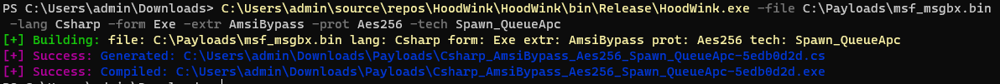

# HoodWink
Simple Loader Generator for me to learn evasion techniques

### Overview
Current
1. HoodWink will read in a file containing shellcode
2. Encrypt it with AES 256 using random key & iv and Base 64 encode
3. This is then placed into a generated source file using a given injection method (in help below) and compiled
- (only implemented for Csharp right now)

Later versions will include more options for encryption, injection, languages, and more

<details>
<summary>Later versions will incorporate</summary>

More injection techniques
- Process Hollow
- Thread Hijack
- ...

Extras
- PPID Spoofing
- BlockDlls
- Module Stomping
- ...

Do above with
- both shellcode and dlls
- kernel32 and ntdll.dll (direct syscalls)
- In other languages (C++, Nim, Rust, Python, ...)
</details>

#### Help Menu
```
Show Modules:
    .\HoodWink.exe  -showall        Show all Modules
    .\HoodWink.exe  -show <lang>    Show Modules for Lang
Syntax:
    .\HoodWink.exe -file <name> -lang <name> -form <name> -extr <name> -prot <name> -tech <name>
Example:
    .\HoodWink.exe -file C:\Payloads\msf.bin -lang Csharp -form Exe -extr AmsiBypass -prot Aes256 -tech Spawn_QueueApc
```

#### Usage Example


### Extras
<details>
<summary>Structure</summary>

I did not do this yet, ha!

</details>
